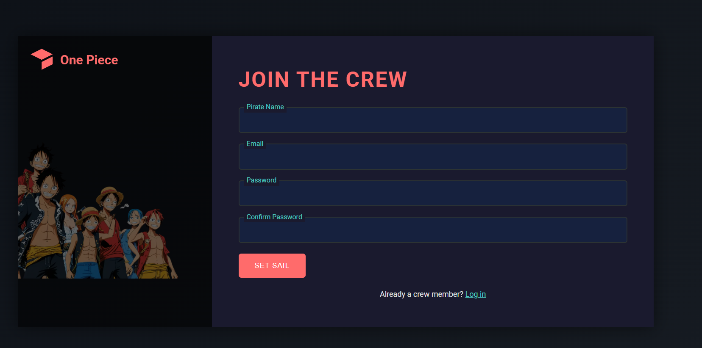

# Sign-Up Form



🚀 A sleek and modern sign-up form built using **HTML, CSS, and JavaScript**. The project features a responsive design, interactive form elements, and a visually appealing UI.

## 🔗 Live Demo
👉 **[View the Live Project](https://rasool321.github.io/Sign-Up-Form/)**

---

## 📌 Features
✅ Fully responsive design 📱💻
✅ Animated form fields ✨
✅ Beautiful color scheme 🎨
✅ Smooth hover & focus effects 🚀
✅ Form validation with JavaScript ✅

## 🛠️ Technologies Used
- **HTML5** – Structure
- **CSS3** – Styling & animations
- **JavaScript** – Form validation & interactions

## 📂 Project Structure
```
Sign-Up-Form/
│── index.html          # Main HTML file
│── styles.css          # Stylesheet
│── script.js           # JavaScript for form validation
│── screenshots/        # Folder for images & previews
│── README.md           # Project documentation (this file)
```

## 📜 How to Use
1. **Clone the repository:**
   ```bash
   git clone https://github.com/rasool321/Sign-Up-Form.git
   ```
2. **Navigate to the project directory:**
   ```bash
   cd Sign-Up-Form
   ```
3. **Open `index.html` in your browser** or deploy it online.

## 🤝 Contributing
Want to improve this project? Feel free to fork the repository and submit a pull request. 🙌

## 📧 Contact
📩 If you have any questions, reach out to me via GitHub: [rasool321](https://github.com/rasool321)

---

⭐ If you like this project, don't forget to give it a **star** on GitHub!
